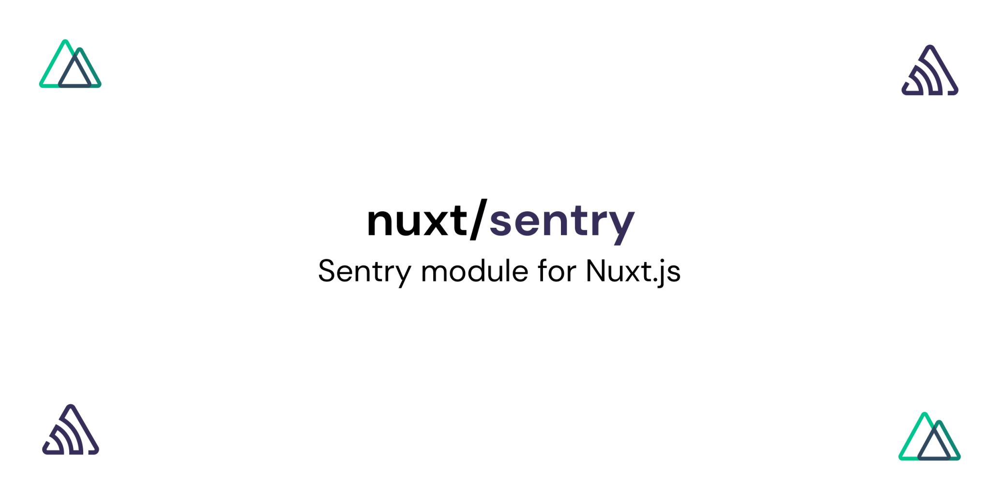

# @nuxtjs/sentry

[![npm version][npm-version-src]][npm-version-href]
[![npm downloads][npm-downloads-src]][npm-downloads-href]
[![Codecov][codecov-src]][codecov-href]
[![Standard JS][standard-js-src]][standard-js-href]

> [Sentry](http://sentry.io) module for [Nuxt](https://nuxtjs.org)

- [✨ &nbsp;Release Notes](https://sentry.nuxtjs.org/releases)
- [📖 &nbsp;Documentation](https://sentry.nuxtjs.org)

## Contributing

1. Install dependencies with `yarn`.
2. Run `yarn dev:prepare` to generate stubbed `dist` directory.
3. Make your changes.
4. Run `yarn lint` and `yarn test` to verify that there is no issues (consider adding new test for your changes).
5. Submit a PR.

## License

[MIT License](./LICENSE)

<!-- Badges -->
[npm-version-src]: https://img.shields.io/npm/dt/@nuxtjs/sentry.svg?style=flat-square
[npm-version-href]: https://npmjs.com/package/@nuxtjs/sentry
[npm-downloads-src]: https://img.shields.io/npm/v/@nuxtjs/sentry/latest.svg?style=flat-square
[npm-downloads-href]: https://npmjs.com/package/@nuxtjs/sentry
[codecov-src]: https://img.shields.io/codecov/c/github/nuxt-community/sentry-module.svg?style=flat-square
[codecov-href]: https://codecov.io/gh/nuxt-community/sentry-module
[standard-js-src]: https://img.shields.io/badge/code_style-standard-brightgreen.svg?style=flat-square
[standard-js-href]: https://standardjs.com
